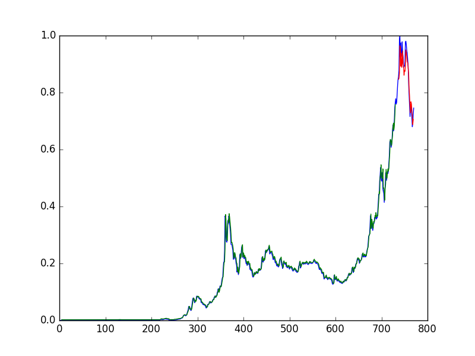

# golden_touch
Predict the price of gold using sequence generation via ANNs with LSTM neurons

## Overview
This is the result of some experimentation I did involving deep learning + sequence/time-series prediction using recurrent neural networks in a finance context. 

## Why gold instead of stocks?
Time-series prediction applied to stocks carries with it a certain set of difficulties, mainly due to changes in the value of the companies behind those stocks which can affect a stock's performance to a significant degree. Just analyzing a graph won't really give you a totally accurate picture of stock market movements. 

Gold, on the other hand, is a commodity of which the supply/demand is relatively constant, and whose price fluctuations are usually driven by the actions of large institutional investors/funds (like central banks) in response to general market movements. Since these are generally cyclical in nature, there might be some discernable pattern that a neural net can actually learn and reproduce.

And in any case, I'm pretty sure everyone has done stocks at this point. Figured I'd try my hand at doing something a little different.

## Testing (Does this thing work?)
Yes, this turned out to work pretty well. When trained and tested on train/test subsets of the Bundesbank gold price dataset from Jan 1st, 1950 - Jun 6th, 2014 (included in this repo), the model achieved an average error of about 6 dollars. You can run the test yourself, too. Just clone the repo, cd into it, and run python test_model.py.

Here's the resulting normalized graph generated by the test script:

 

The blue line is the original dataset, the green is the training subset used to train the model, and the red is the generated predictions for the subset of the data not seen by the model.

## How to run
Clone the repo, cd into the directory, and run python predict.py with 5 system arguments, representing the gold price, in dollars, on the first day of each of the five preceding months, in chronological order. 

Example: "python predict.py 1243.068 1298.713 1336.560 1299.175 1288.913"

This command will print out the predicted price on the first day of the following month to the console.

##Resources + further reading
Check out [this tutorial](http://machinelearningmastery.com/time-series-prediction-lstm-recurrent-neural-networks-python-keras/) to see the base code from which I built the model. Also click [here](https://github.com/datasets/gold-prices) for the github repo which has the data I used to train and test. 

And click [here](http://www.investopedia.com/articles/active-trading/031915/what-moves-gold-prices.asp) to access an article on gold prices and what affects them.

